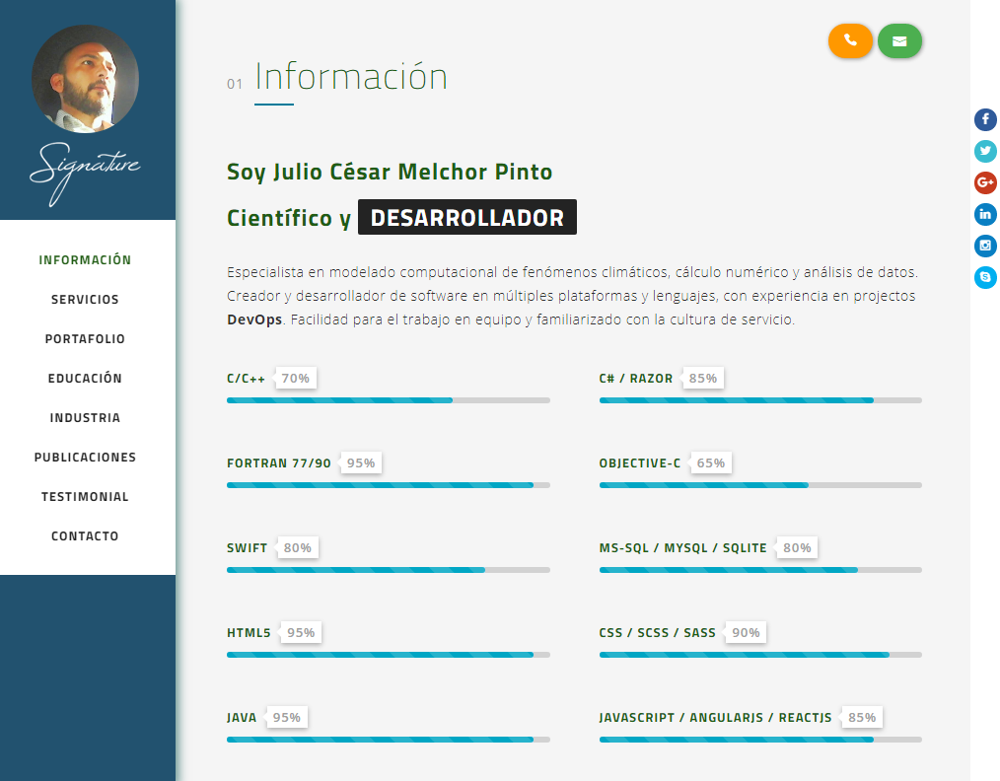
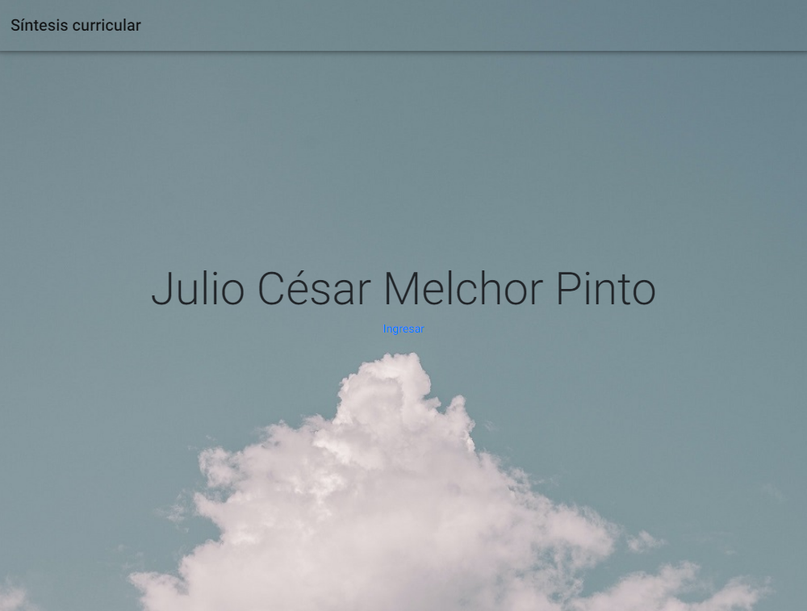

# Curriculum - Julio Melchor

Angular Application for curriculum vitae.

## Features

This project includes the following features:

- Angular 9.1.7
- 🚀 Full Angular PWA, Lasy Loading & SEO.
- 🔨 Angular MetaService for metadata injection.
- 🔥 Google Firebase for FireHosting and Realtime Database.
- 📌 Google Tag Manager.
- Angular Material 9.2.4 with custom theme.
- Ngx-Bootstrap 5.6.1
- Responsive flex layout.
- Elegant Icons & Font Awesome.
- Local server side with json-server for development.
- PDF Viewer in dialog box.
- CompoDoc for automated documentation.
- Angular PWA assets generator for icons.

## Demo & Doc

Find a demostration on [https://jcmelchorp.web.app](https://jcmelchorp.web.app/ "Firebase Hosting").
For documentation, see [docs/](https://juliomelchorpinto.github.io/jcmelchorp/ "Github Pages").

## Screenshots



** Fig. 1** - View example



** Fig. 2** - Wellcome page

## Install this repository

If you want to use this repository as a template, run:

````
git clone https://github.com/JulioMelchorPinto/jcmelchorp.git
````

## Build requirements

This repository has the following pre-requisites:

- [NodeJS](https://nodejs.org/)
- Google []Firebase](https://firebase.google.com/) Account (optional for Hosting and further features)
- [Google Tag Manager](https://tagmanager.google.com/) Account
- [Angular CLI](https://cli.angular.io/)

The Angular CLI, CompoDoc, PWA asset generator comes with NPM install. If you want to use Angular CLI as a shell command:

```` bash
npm -i -g @angular/cli
````

## Commands

Besides the built-in commands from @angular/cli, this proyect contains other some:

### Local server

First, generate a mock database with *faker*:

```` bash
npm run generate:db
````

And, run server on localhost with *json-server*:

```` bash
npm run server:db
````

### Documentation

By default, this project generate documentation with Material Theme in *docs/* directory.

To generate documentation:

```` bash
 npm run doc:g
````

To serve docuemntation on your browser via localhost:

```` bash
npm run doc:s
````

### Deployment

Build in production environment and deploy on Google Firebase

```` bash
npm run deploy
````

### Reset project to default

To reset project just type:

```` bash
npm run reset
````

### PWA Assets Generator

To generate Apple icons and splash run:

```` bash
npm run pwa:assets
````
